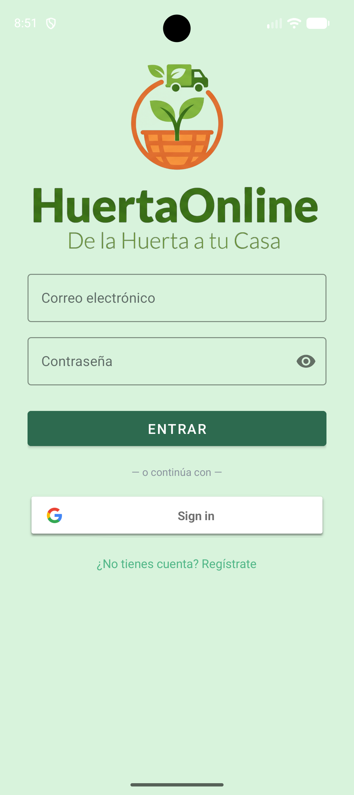
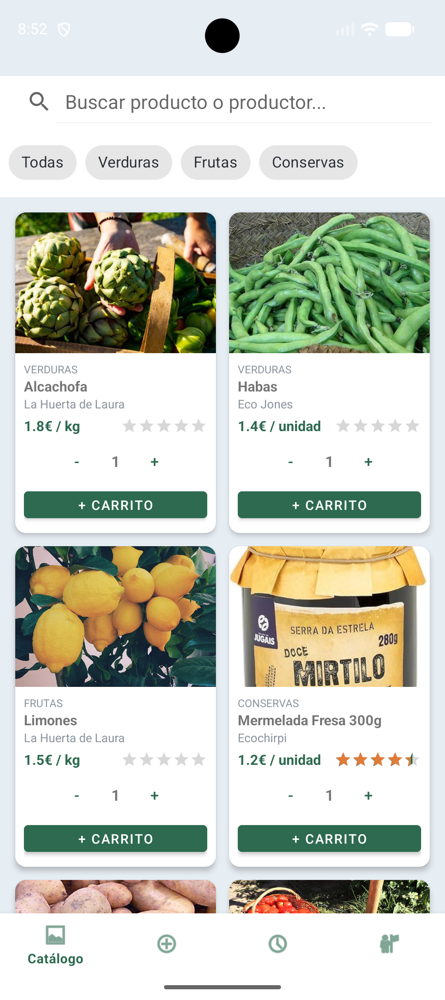
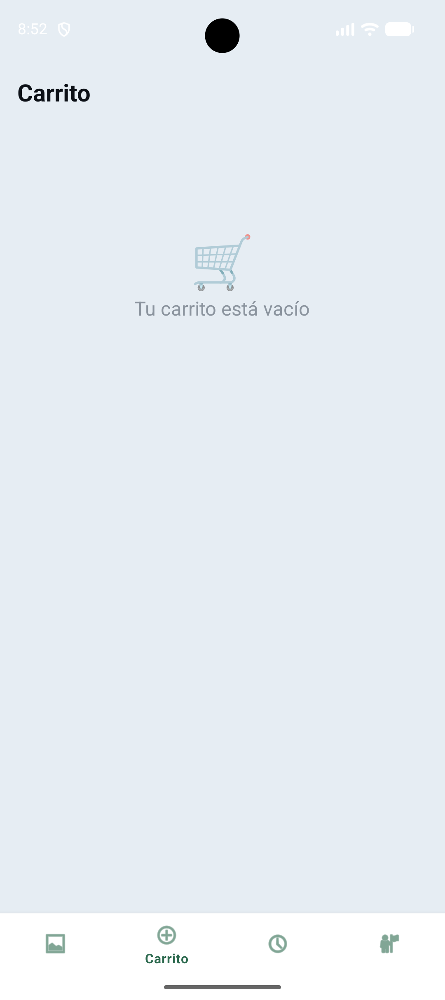
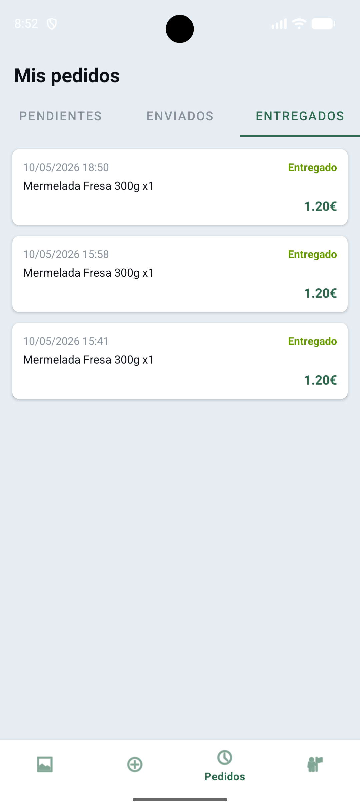
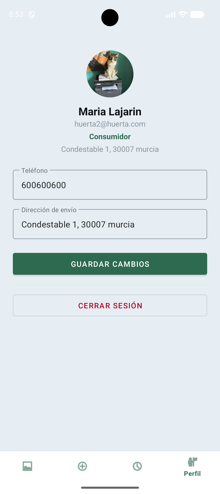
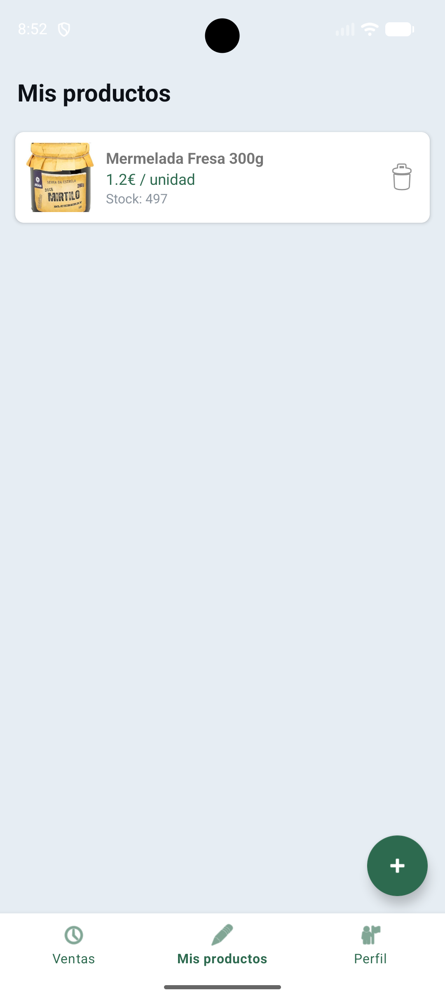
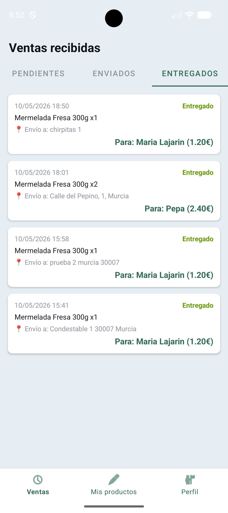
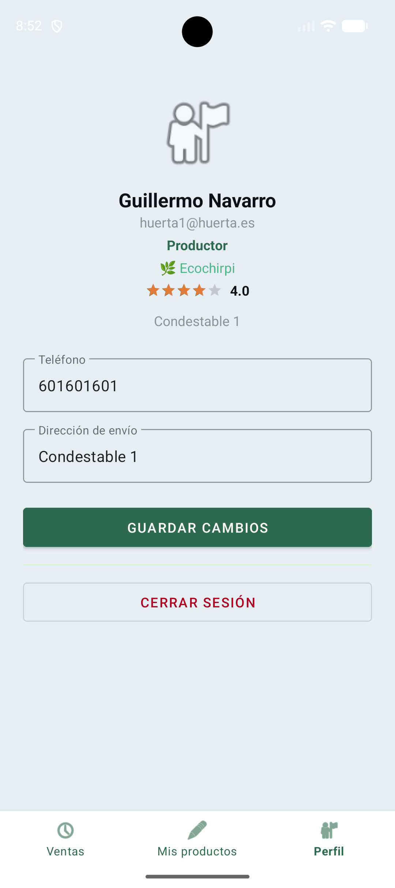

# 🍏 HuertaOnline - Marketplace de Proximidad

HuertaOnline es una aplicación Android nativa que conecta a los pequeños productores de la huerta murciana con el consumidor final, eliminando intermediarios y fomentando el consumo de producto local.

## 🚀 Características Principales
- **Doble Perfil de Usuario:** Rol de Productor (gestión de catálogo y stock) y Rol de Consumidor (exploración y compra).
- **Sincronización en Tiempo Real:** Gestión de datos e inventario mediante Firebase Firestore.
- **Persistencia Local:** Carrito de compra con almacenamiento en base de datos local usando Room.
- **Seguridad y Autenticación:** Acceso mediante email/contraseña y Google Sign-In.
- **Flujo de Compra Completo:** Simulación de pasarela de pago y seguimiento del estado del pedido.
- **Arquitectura Robusta:** Patrón de diseño MVVM con repositorios y uso de corrutinas de Kotlin.

## 🛠️ Stack Tecnológico
- **Lenguaje:** Kotlin + Corrutinas.
- **Backend:** Firebase (Auth, Firestore, Storage).
- **Jetpack Components:** Navigation Component, ViewBinding, ViewModel, LiveData.
- **Librerías:** Glide (Carga de imágenes).

## 📋 Requisitos de Instalación
1. Clonar el repositorio.
2. Añadir el archivo `google-services.json` en la carpeta `/app`.
3. Compilar con Android Studio.
4. SDK Mínimo: API 26 (Android 8.0).

## 📸 Capturas de la Aplicación

### 🔐 Acceso

  

### 🛒 Vista del Consumidor

  
  
  
  

### 👨‍🌾 Vista del Productor

  
  
  

---
*Proyecto Final de Ciclo - Grado Superior en Desarrollo de Aplicaciones Multiplataforma (DAM)*
